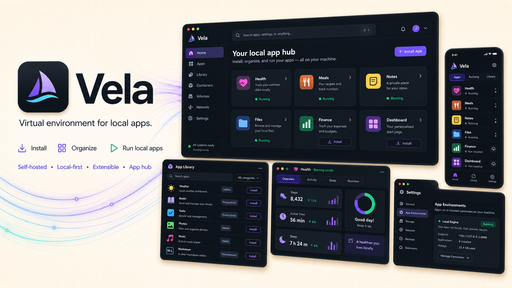
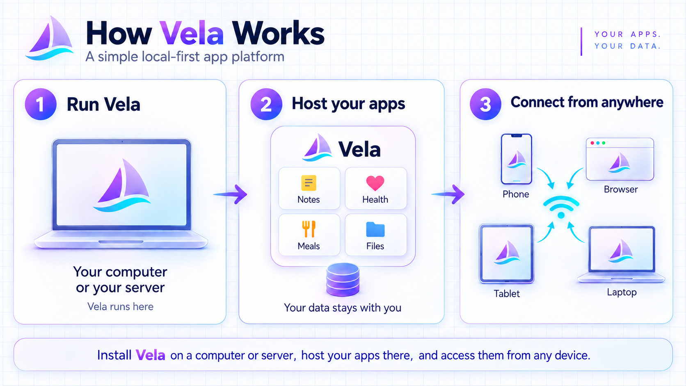

<div align="center">



# Vela

**Virtual Environment for Local Apps**

**Your personal app server.**
Install Vela Server on your computer and manage your local apps from a browser.
Your server keeps your apps, settings and data in one place, on your own machine.

<br>


[](LICENSE)
[](CHANGELOG.md)

[](#install-with-serverkit)

<br>

[Quick Start](#-quick-start) · [Your Devices](#-your-devices) · [The Idea](#-the-idea) · [Architecture](#-architecture) · [Platforms](#-platforms) · [Changelog](CHANGELOG.md) · [Develop](#-develop) · [Contributing](#-contributing) · [Support](#-support-vela)

</div>

---

## 🚀 Quick Start

1. **Download Vela Server** for your computer from [Releases](https://github.com/jhd3197/vela/releases).
2. **Install and open Vela.** On Windows, run the `windows-x64-setup.exe` download. Portable archives are also available.
3. **Your dashboard opens in your browser.** Add an app from the Library and start using it.

The server download includes everything it needs. No Python, Node.js or Git setup.
Keep Vela Server running while you use your apps.

On Windows, Vela runs beside the clock. Its tray menu opens the dashboard,
starts or stops the server, and lets you turn on **Start at sign in**.
On macOS/Linux, extract the archive and run `./Vela` in a terminal.

[Server guide](docs/SERVER.md) · [Build from source](docs/DEVELOPMENT.md)

### Install with ServerKit

Already running [ServerKit](https://serverkit.ai)? Import
`https://github.com/jhd3197/vela` as a new service using the repository's
[serverkit.yaml](serverkit.yaml). It builds the dashboard and server together
and keeps your apps and data on a persistent disk.

Set your HTTPS address and trusted proxy address, retrieve the generated
password, and configure the domain in ServerKit. Follow the
[ServerKit setup guide](docs/SERVER.md#serverkit) for the settings and first sign-in.
Use the `dev` branch until these deployment files are released on `main`.

## 📲 Your Devices

One computer runs **Vela Server**. Your browser is how you use it.
You do not need a separate server installation on every phone, tablet or laptop.

On the server computer, open **http://localhost:7700**. To connect another device,
follow [network setup](docs/SERVER.md#another-device). This preview requires a
password and HTTPS for network access; automatic setup is still to come.

Once connected, save Vela to your home screen or dock for quick access. The
server computer needs to stay on while you use its apps.

## 💡 The Idea

Most app hubs are built for their owner. Vela is built for **everyone**.

| | |
|---|---|
| **Open access**<br>No gatekeeping, no accounts required to start. If you can open a browser, you can use Vela. | **A browser is all you need**<br>Vela lives in the browser. No heavy installs to get started. |
| **Your apps, your machine**<br>An *app* in Vela is something that runs **locally** — you keep your data, your config, your apps. | **A hub, not a store**<br>Vela is a launcher and manager for local apps, not a marketplace with walls around it. |

The name "Vela" continues our tradition of names inspired by Venezuela,
reflecting our origins and cultural background — a *vela* (sail) is what
carries you wherever you want to go.

## ⚙️ How It Works



```
┌─────────────┐      ┌──────────────┐      ┌─────────────┐
│   Browser   │ ───> │   Vela Hub   │ ───> │  Local Apps  │
│  (anyone)   │      │ (open access)│      │ (your device)│
└─────────────┘      └──────────────┘      └─────────────┘
```

1. **Open the hub** in your browser.
2. **Browse available apps** — each app is a self-contained package with its own config.
3. **Run an app locally** — Vela launches it on your machine and gives you a place to manage it.
4. **Keep your apps** — they live with you, not on someone else's server.

Vela makes one request of its own: once a day it asks GitHub which release is
newest, so it can tell you when there is an update. That request is anonymous —
no identifier, no version report, nothing about your apps or your data — and
**Settings → Updates** turns it off, after which Vela contacts nothing. There is
no telemetry and no crash reporting; when something breaks, the record stays on
your computer for you to read.

An app is just a folder with an `app.json` manifest (name, icon, run command,
per-platform config — see the standalone `vela-hello` repository for a legacy example,
or `vela-templates` for a v2 starter). Installed apps live in `~/.vela/` (override with `VELA_DATA_DIR`).
The full format and REST API are documented in
[docs/CONTRACT.md](docs/CONTRACT.md).

Apps can also be wired together. **Automations** builds a set of steps visually —
on a schedule, on an authenticated web request, or when you press Run — and Vela
runs them on the server computer while the browser is closed. An automation that
wants to change an app's data shows the exact request and waits for you to allow
it. See the [automations guide](docs/AUTOMATIONS.md).

Ask can be more than one assistant. Create **bots** with their own instructions,
model and read-only access, chat with one, or put two to four of them in a
**room** where they answer in turn. See the [bots and rooms guide](docs/BOTS.md).

The [repository guide](docs/REPOSITORIES.md) describes the current split into
the hub, public SDK, contracts, templates, catalog and independent apps.

## 🏗️ Architecture


The hub is a **FastAPI backend** serving a **React frontend**, with a
config-driven app registry on top of per-platform runners
(`vela/runners/`: POSIX, Windows, and an Android stub). Every app declares
itself in an `app.json` manifest; the hub installs it into `~/.vela/`, launches
it as a local process or serves it as a web app — after that the hub stays out
of the way, and apps and their data never leave the machine.

## 🖥️ Platforms

| Platform | Status |
|----------|--------|
| iPhone / iPad | Browser access to your Vela Server — [device setup](#-your-devices) |
| macOS / Linux | ✅ Local-process apps + web apps |
| Windows | ✅ Local-process apps + web apps |
| Android | 🔜 Native runner next (web apps already work via Chrome) |

## 🧭 Design Principles

Borrowed from our previous hub project and extended for everyone:

- **Config-driven**: apps and views are declared in config, not hardcoded.
- **Plugin/mixin architecture**: backends, runners, and platforms are swappable pieces.
- **Local-first**: the hub is a window; the apps and their data belong on your device.
- **Open by default**: open source, open access, open to community apps.

## 🛠️ Develop

The [developer guide](docs/DEVELOPMENT.md) covers source setup, tests and building
server downloads. The [repository guide](docs/REPOSITORIES.md) maps the hub,
SDK, contracts, templates and independent apps.

This repository owns the Python server, React dashboard and compatibility tests.
The separate `vela-*` repositories are for app and SDK development; users do not
need to clone them to run the packaged server.

## 🤝 Contributing

Contributions are welcome. Read [CONTRIBUTING.md](CONTRIBUTING.md) for setup,
verification and pull request guidance. See [CONTRIBUTORS.md](CONTRIBUTORS.md)
for credits and [CHANGELOG.md](CHANGELOG.md) for notable changes.

```text
fork → branch → change → verify → pull request
```

**Useful links:** [Server guide](docs/SERVER.md) · [App guide](docs/APPS.md) ·
[Automations](docs/AUTOMATIONS.md) · [Bots and rooms](docs/BOTS.md) ·
[Developer guide](docs/DEVELOPMENT.md) · [Report a vulnerability](SECURITY.md)

---

## 💛 Support Vela

Vela is free and open source. If it saves you time, you can help keep it going:

- ⭐ [Star the repo](https://github.com/jhd3197/vela) — it costs nothing and helps a lot
- 💖 [GitHub Sponsors](https://github.com/sponsors/jhd3197)
- ☕ [Buy Me a Coffee](https://buymeacoffee.com/jhd3197)

### 💎 Crypto

| | Asset | Network | Address |
|:---:|---|---|---|
|  | **USDT** | **TRC-20** · Tron | `TTiCtqLauF1iSW2YGB3b78KmRxRqoLCgeL` |
|  | **USDT / ETH** | **ERC-20** · Ethereum | `0xD13D5355Fa214e8317fea2ff192a065BaeC13527` |
|  | **BTC** | **Bitcoin** | `bc1qatx67n3qxdvuv3arc9j8aytk34f22g02k9c7vr` |
|  | **SOL** | **Solana** | `AWXzqtBEgUfteHPQtDegsZ6D5y57M3GGdKPD8rR7h6xu` |


---

## 📄 License

MIT — see [LICENSE](LICENSE).

---

<div align="center">

**Vela** — Your apps, your machine, your hub.

Made with ❤️ by [Juan Denis](https://juandenis.com)

</div>
